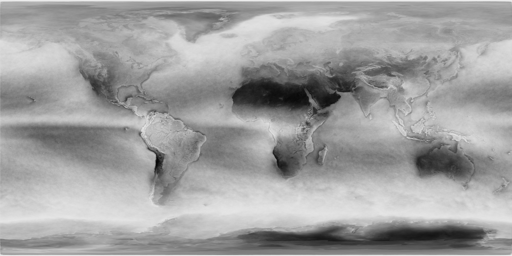

# Sareana: Salient Region Analysis
The intent of this analysis is to prioritize salient regions of the world for use with visual satellite navigation. 

The process is as follows:
1. ```make_grid_ims.py``` to section the Blue Marble world images in the bm1k folder into 1 image for each Military Grid Reference System (MGRS) region. 

2. ```get_maps.py``` to first create saliency maps for each region image using ```cv2.StaticSaliencyFineGrained()```, and then to merge all of the saliency maps back together into an image of the full world:


3. ```get_maps.py``` to consolidate world cloud maps in cloud_maps folder downloaded from https://neo.gsfc.nasa.gov/view.php?datasetId=MYDAL2_M_CLD_FR into a single average cloudiness map of the world:


4. ```sareana.py``` to combine the cloud map and the saliency map. The inverse of the cloud map is used as the blue channel of a new image and the saliency map as the green channel. The resulting output looks like this:

Additionally, ```sareana.py``` will output a region level combined slaiency and cloudiness map with equal weighting where each pixel in a region is assigned the value of the normalized sum of the saliency and inverse cloudiness in the image:

A sorted numpy array ```sorted_region_saliencys.npy``` is saved as well, containing regions and their saliencys in descending order of saliency.